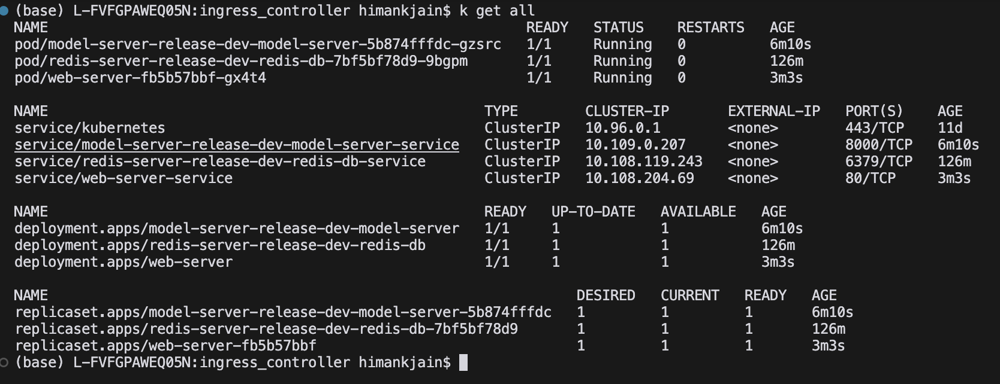
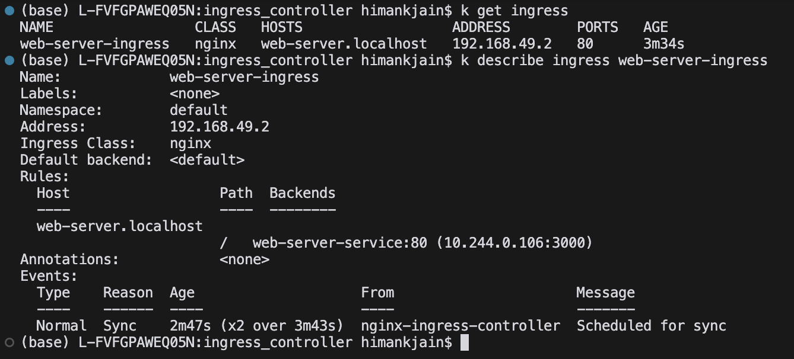
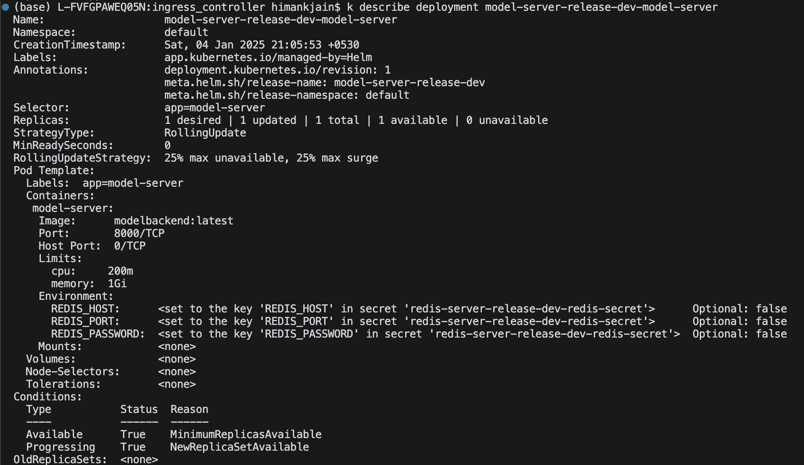
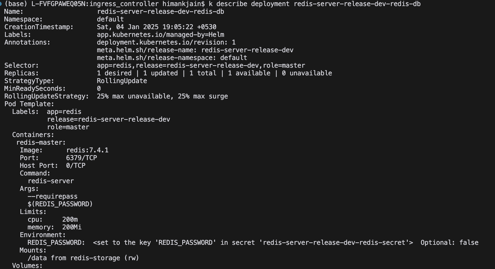
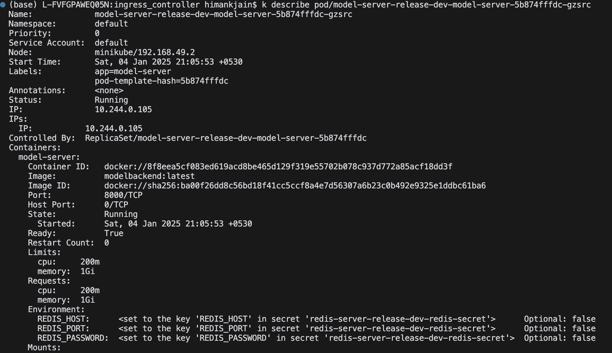
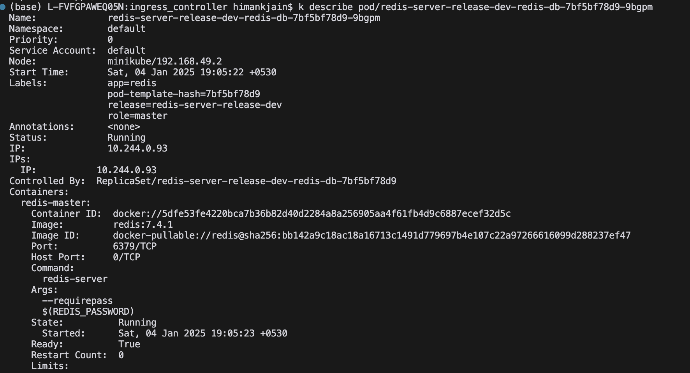
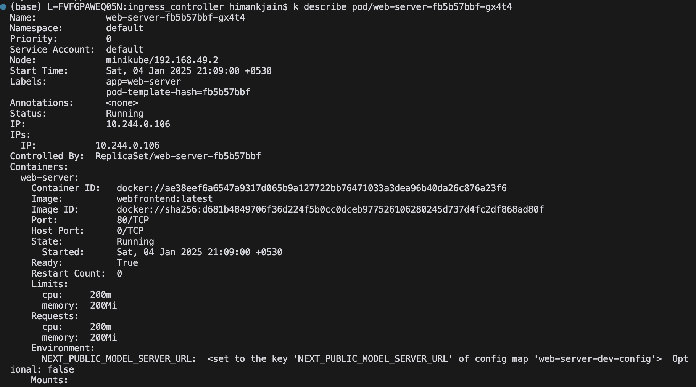
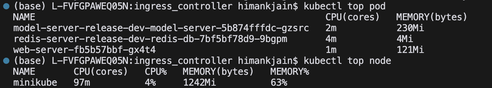
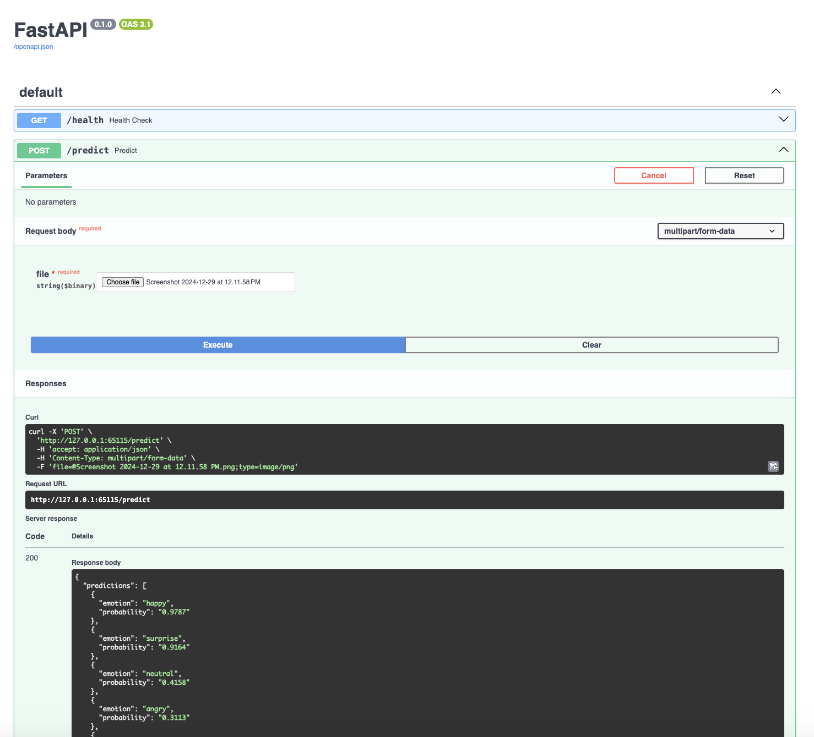
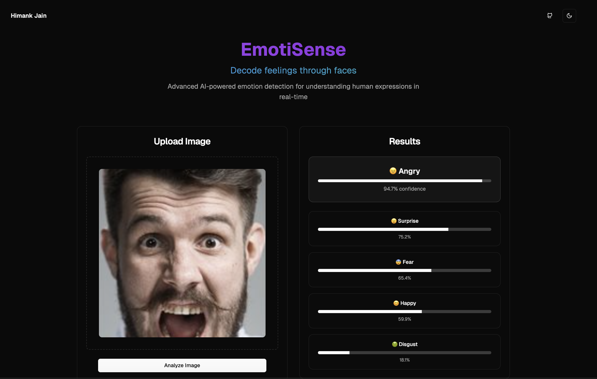

# Kubernetes FastAPI Deployment Project using Helm 🚀

 
 
 


## 🌟 Project Overview

This project demonstrates how to deploy a **FastAPI** application using **Kubernetes** with **Helm** and **Minikube**. The application includes face emotion detection capabilities powered by an ViT model. The deployment consists of a backend service, a frontend interface, and the necessary Kubernetes configurations to orchestrate the deployment.

## 🛠️ Components

1. **Backend**: 
   - **Technology**: FastAPI
   - **Purpose**: Serves a ViT model for face emotion detection
   - **Image**: `modelbackend:latest`
   
2. **Frontend**: 
   - **Technology**: FastHTML
   - **Purpose**: Provides a user interface for face emotion detection
   - **Image**: `webfrontend:latest`

3. **Redis**: 
   - **Technology**: Redis
   - **Purpose**: Provides a Redis server for caching
   - **Image**: `redis:latest`
   
4. **Kubernetes**: 
   - **Tool**: Minikube
   - **Purpose**: Orchestrates the deployment of the backend and frontend services

5. **Helm**: 
   - **Tool**: Helm
   - **Purpose**: Package manager for Kubernetes that simplifies the deployment and management of containerized applications.

## ⚙️ Prerequisites

- **Docker**: Ensure Docker is installed and running.
- **Minikube**: Install Minikube for local Kubernetes cluster setup.
- **kubectl**: Kubernetes command-line tool installed.
- **Python 3.8+**: Required for FastAPI backend.

## 🚀 Installation & Deployment

1. **Start Minikube Cluster**
   ```bash
   minikube start
   ```

2. **Build Docker Images**
   ```bash
   docker build -t modelbackend:latest -f model-server/Dockerfile .
   docker build -t webfrontend:latest -f web-server/Dockerfile .
   ```

3. **Deploy Backend**
   ```bash
   helm create model-server-helm
   helm install model-server-release-dev model-server-helm --values model-server-helm/values.yaml -f model-server-helm/values-dev.yaml
   ```

4. **Deploy Frontend**
   ```bash
   helm create web-server-helm
   helm install web-server-release-dev web-server-helm --values web-server-helm/values.yaml -f web-server-helm/values-dev.yaml
   ```

5. **Host Redis**
   ```bash
   helm create redis-helm
   helm install redis-release-dev redis-helm --values redis-helm/values.yaml -f redis-helm/values-dev.yaml
   ```
    
6. **Set Up Ingress Controller**
   ```bash
   kubectl apply -f deployment/ingress_controller/ingress.yaml
   ```

7. **Expose Ingress**
   ```bash
   minikube tunnel
   ```

## 📋 Available Commands

- **List All Resources**
  ```bash
  kubectl get all
  ```
  

- **View Ingress Resources**
  ```bash
  kubectl get ingress
  ```
  
  
- **Describe Ingress**
  ```bash
  kubectl describe ingress
  ```
  

- **Describe Deployments**
  ```bash
  kubectl describe deployment model-server-release-dev-model-server
  kubectl describe deployment redis-release-dev-redis
  kubectl describe deployment web-server-release-dev-web-server
  ```
  
  

- **Describe Pods**
  ```bash
  kubectl describe pod model-server-release-dev-model-server-5b874fffdc-gzsrc
  kubectl describe pod redis-release-dev-redis-XXXXXXX-XXXX
  kubectl describe pod web-server-release-dev-web-server-XXXXXXX-XXXX
  ```
  
  
  

- **Monitor Resources**
  ```bash
  kubectl top pod
  kubectl top nodes
  ```
  

- **Get Detailed YAML of All Resources**
  ```bash
  kubectl get all -o yaml
  ```
  [Output](all_output.yaml)

## 📈 Output Monitoring

After deployment, you can monitor the status of your Kubernetes resources using the above commands. Ensure that all pods are running and services are properly exposed via the ingress controller.

FastAPI Docs:


Frontend:


## 🖥️ Accessing the Application

Once deployed, access the frontend application through the URL provided by the ingress controller. This interface allows users to upload images for classification, leveraging the backend FastAPI service.

## 🧩 Technologies Used

- **FastAPI**: High-performance web framework for building APIs with Python.
- **Vision Transformer**: ViT model for face emotion detection.
- **Docker**: Containerization platform to package applications.
- **Kubernetes**: Orchestration system for automating deployment, scaling, and management of containerized applications.
- **Minikube**: Local Kubernetes environment for development and testing.
- **NodeJS and Shadcn**: Frontend framework for building user interfaces.
- **Redis**: In-memory data structure store for caching.

---
*Happy Deploying! 🎉*
